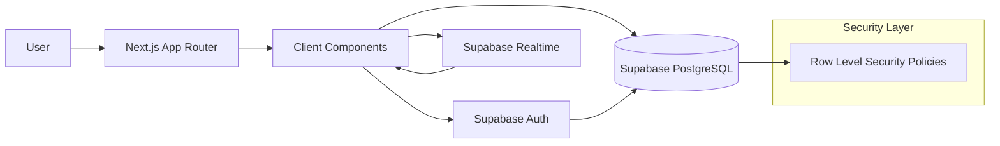

<p align="center">
  
</p>

<h3 align="center">Intelligent Bookmark Manager • Next.js 15 • Supabase • Tailwind CSS</h3>

<p align="center">
  
  
  
  
  
  
</p>

---

## Overview

Smart Bookmarks is a modern, secure bookmark management application built using **Next.js 15**, **Supabase**, and **Tailwind CSS**.

It enables:

- Google OAuth authentication  
- Tag-based bookmark organization  
- Real-time cross-device updates  
- Row Level Security (RLS) enforcement  

---

## Live Demo

**Production URL:**  
https://assignment-task-ag93.vercel.app/

---

## Features

- Google OAuth authentication  
- Smart tag-based organization  
- Real-time synchronization  
- Row Level Security enforcement  
- Type-safe TypeScript implementation  
- Responsive Tailwind UI  
- App Router architecture  

---

## Tech Stack

| Layer | Technology |
|-------|------------|
| Framework | Next.js 15 (App Router) |
| Language | TypeScript |
| Database | Supabase PostgreSQL |
| Authentication | Supabase Auth (Google OAuth) |
| Realtime | Supabase Channels |
| Styling | Tailwind CSS |
| Deployment | Vercel |

---

## Architecture

### System Diagram



Flow Description

User interacts with the Next.js frontend.
Google OAuth is handled via Supabase Auth.
Bookmark data is stored in Supabase PostgreSQL.
Row Level Security restricts access per user.
Supabase Realtime pushes database changes to the UI.

```app/
├── login/
├── dashboard/
├── api/

components/
├── BookmarkList.tsx
├── BookmarkForm.tsx

lib/
├── supabaseClient.ts

supabase/
├── schema.sql

walkthrough.md

Setup Instructions
1. Clone Repository
git clone <your-repo-url>
cd smart-bookmarks
2. Install Dependencies
npm install
3. Configure Environment Variables

Create:

.env.local

Add:

NEXT_PUBLIC_SUPABASE_URL=your-project-url
NEXT_PUBLIC_SUPABASE_ANON_KEY=your-anon-key

4. Configure Database

Run:
supabase/schema.sql

Inside Supabase SQL Editor.

This will:

Create tables
Enable Row Level Security
Add access policies

5. Configure Google OAuth

Navigate to:
Supabase Dashboard → Authentication → Providers

Enable Google

Add Client ID
Add Client Secret
Configure redirect URI

6. Start Development Server

npm run dev

Open:

http://localhost:3000

Security Model
Users can only access their own bookmarks
Policies are enforced at the database layer
No cross-user data exposure
Authentication validated per request
Realtime Implementation

supabase
  .channel('bookmarks')
  .on(
    'postgres_changes',
    { event: '*', schema: 'public', table: 'bookmarks' },
    handler
  )
  .subscribe()

Supported events:
INSERT
DELETE
UPDATE
No polling required.

Challenges & Solutions

1. Email Signups Disabled Error
Error
AuthApiError: Email signups are disabled
Fix
Enable provider:
Authentication → Providers → Email → Enable (ON)

2. Next.js 15 searchParams Breaking Change
Issue
searchParams.error caused runtime crash.
Fix
const params = await props.searchParams

3. Realtime Updates
Issue
Bookmark list required manual refresh.
Solution
Moved rendering to client component (BookmarkList)
Subscribed to Supabase realtime channel
Updated local state on INSERT and DELETE

Deployment

Push repository to GitHub
Import project into Vercel
Add environment variables
Deploy

Future Enhancements
AI tag suggestions
Bookmark metadata previews
Folder-based organization
Full-text search
Shareable collections\
Browser extension
Bulk import/export
Developer Notes
App Router best practices followed
Strict TypeScript typing
Realtime handled in client layer
RLS validated with multi-user testing

Clean separation of UI and data layer

<p align="center"> Built with Next.js + Supabase + Tailwind CSS </p> <p align="center">  </p> ```
